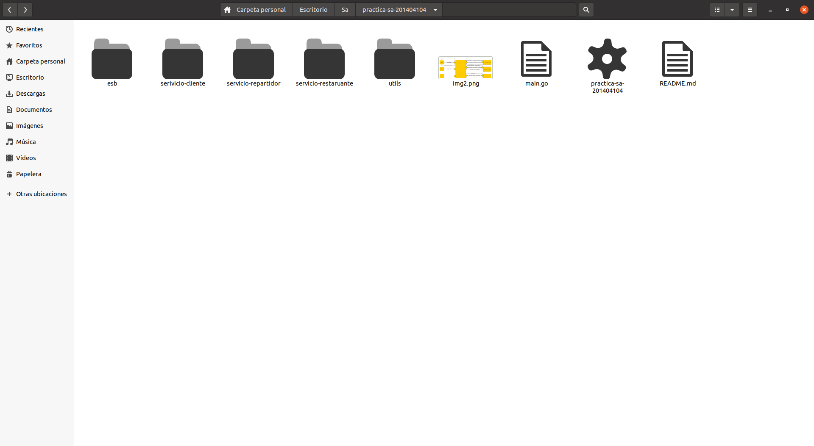
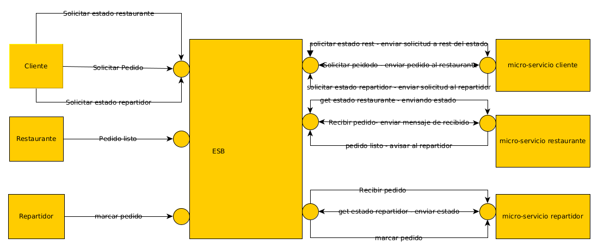

Andrea Nicte Vicente Campos

201404104


Prueba de funcionalidad: https://youtu.be/VuCj23knNyo

# Practica 6


## Instalando sonarqube:

```
docker run -d --name sonarqube -p 9000:9000 sonarqube
```

funciona sobre el puerto 9000


Descargando sonnarscanner:

```
https://docs.sonarqube.org/latest/analysis/scan/sonarscanner/
```


En sonarqube le puse el nombre de Gotest al proyecto


Se ejecuta la siguiente linea de comando, sobre el cd en el que se encuentren las pruebas (estas lineas son obtenidas a través de sonar)

```
sonar-scanner \
  -Dsonar.projectKey=Gotest \
  -Dsonar.sources=. \
  -Dsonar.host.url=http://localhost:9000 \
  -Dsonar.login=b821e2cb1016f47467bb510b35275e1a9f1a434a
```


## Pruebas unitarias:

se encuentran en el archivo utils_test.go


```go
/*
	prueba que verifica si la suma de dos numeros es correcta
 */

func TestSuma(t *testing.T) {
	fmt.Println("Test funcion suma:")
	valor := utils.Suma(7, 23)
	if valor != 30 {
		t.Error("Se esperaba 30 y se obtuvo", valor)
	}
}
```


```go
/*
	prueba que verifica que el procedimiento de buscar servicios sea correcto
*/

func TestGetDataService(t *testing.T) {
	fmt.Println("Test funcion GetDataService:")
	servicios := []utils.ServicioData{}
	servicios = append(servicios, utils.ServicioData{"8082", "informar_estado_cliente","/informar_estado_cliente","repartidor","GET"})
	servicios = append(servicios, utils.ServicioData{"8081", "estado_pedido","/estado_pedido","restaurante","GET"})

	_,existe := utils.GetDataService(servicios,"repartidor","informar_estado_cliente")

	if !existe {
		t.Error("se esperaba un valor verdero y se obtuvo", false)
	}

}
```

```go
/*
	preuba que verifica si la funcion para decodifcar funciona de manera cocrrecta
*/

func TestDecodificador(t *testing.T) {
	fmt.Println("Test funcion GetDataService:")
	body := ioutil.NopCloser(strings.NewReader("\"{\"Message\":\"Hola mundo\",\"Id\":1}\""))
	message:= utils.JSONMessageGeneric{"test",1}
	valor:= utils.Decodificador(body,&message)

	if(valor.Message!="test"){
		t.Error("Se esperaba la palabra test y se obutvo", valor.Message)
	}
}
```


## Artefacto

practica-sa-201404104.exe




Comando para generacion:

```
go build
```


### Implementacion del ESB

En lugar de que cada servicio interactue entre si, pasaran por el esb, este tendrá los 9 endpoints en un puerto y decidirá a que servicio enviar las solicitudes 





### Endpoints:

```go
func handle()  {

	router := mux.NewRouter()


	router.HandleFunc("/repartidor_marcar_pedido",repartidorMarcarPedido).Methods("POST")
	router.HandleFunc("/repartidor_recibir_pedidio",repartidorRecibirPedido).Methods("POST")
	router.HandleFunc("/restaurante_pedido_listo",restaurantePedidoListo).Methods("POST")
	router.HandleFunc("/repartidor_estado",repartidorEstado).Methods("GET")
	router.HandleFunc("/cliente_estado_repartidor",clienteEstadoRepartidor).Methods("GET")
	router.HandleFunc("/restaurante_estado_restaurante",restauranteEstadoPedido).Methods("GET")
	router.HandleFunc("/cliente_estado_restaurante",clienteEstadoRestaurante).Methods("GET")
	router.HandleFunc("/cliente_solicitar_pedido",clienteSolicitarPedido).Methods("POST")
	router.HandleFunc("/restaurante_recibir_pedido",restauranteRecibirPedido).Methods("POST")
	router.HandleFunc("/registrar_microservicio",registrarMicroServicio).Methods("POST")
	http.ListenAndServe(":8085", router)

}
```


1. repartidorMarcarPedido: se encarga de que en el micro-servicio del repartidor se marque como pedido listo
2. repartidorRecibirPedido: se encarga de recibir los pedido que el restaurante ya marca como listo
3. restaurantePedidoListo: el restaurante indica al repartidor de que el pedido ya esta listo
4. repartidorEstado: envia el estado del repartidor
5. clienteEstadoRestaurante: el cliente solicita al restaurante el estado del pedido
6. clienteEstadoRepartidor: el cliente quiere solicitar el estado del repartidor
7. restauranteEstadoPedido: el restaurante devuelve estado del pedido
8. clienteSolicitarPedido: el cliente solicita un pedido al restaurante
9. restauranteRecibirPedido: el restaurante recibe un pedido del cliente


Cada una de estas funciones, son http, encargadas de escuchar solicitudes. 


## Utils:

Se agregan 4 funciones, estas son encargadas de realizar peticiones de manera mas generica:

- RegistrarServicio: permite registrar los servicios en el esb
- PeticionJSONGeneric: permite realizar peticiones de manera genericas
- PeticionRestaurante: permite que el restaurante realice peticiones 
- PeticionRepartodpr: permite que el repartidor realice peticiones


Funcion GetDataService: permite buscar en memoria, entre los servicios registrados el servicio que se va usar

```go
func GetDataService(array []ServicioData, padre string, nombreServicio string) (ServicioData, bool){

	for i:= 0; i< len(array); i++{

		if array[i].Padre==padre && array[i].Nombre == nombreServicio {

			return array[i],true
		}

	}
	return ServicioData{"","","","",""},false

}
```


Structs agregados: 

```go
//se utiliza para guardar en memoria los servicios registrdaso en el esb
type ServicioData struct {

	Host string
	Nombre string
	Ruta string
	Padre string
	Method string


}
```

