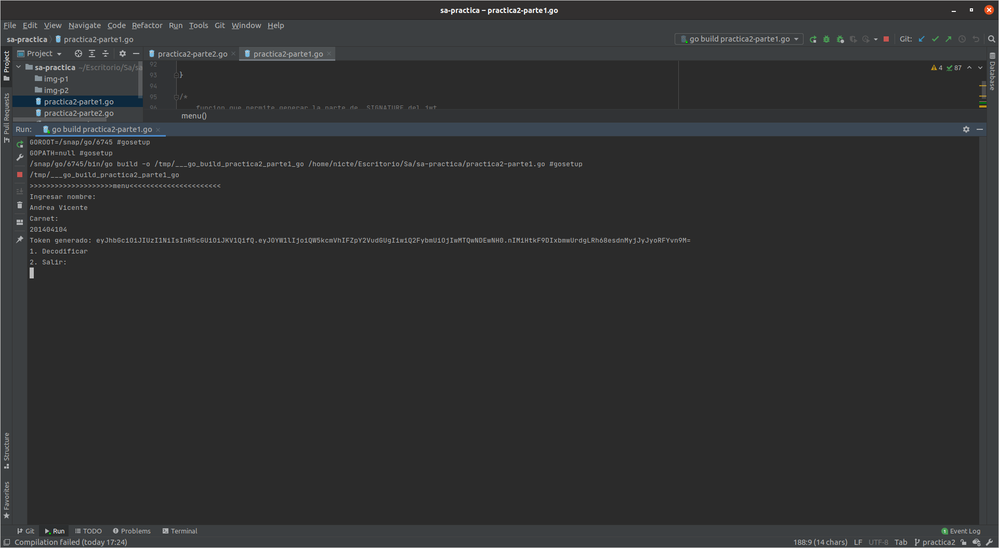

ndrea Nicte Vicente Campos

201404104

Software Avanzado

# PRACTICA 2

## Parte 1

### Funciones

Función para codificar en base64

```go
func base64Encode(src string) string {
	return strings.
		TrimRight(base64.URLEncoding.
			EncodeToString([]byte(src)), "=")
}
```

Función para decodificar en base 64

```go
func base64Decode(src string) string {
	if l:= len(src) % 4; l > 0 {
		src += strings.Repeat("=", 4-l)
	}
	decoded, _ := base64.URLEncoding.DecodeString(src)
	return string(decoded)
}

```

Función para generar el secret

```go
func generateScret() string {
	b := make([]byte, 4)
	rand.Read(b)
	return fmt.Sprintf("%x", b)
}
```

 Función para generar la parte de signature del JWT

```go
func generateSignature(secret string, strFinal string) string {

	key:= []byte(secret)
	h := hmac.New(sha256.New, key)
	h.Write([]byte(strFinal))
	return base64.StdEncoding.EncodeToString(h.Sum(nil))
	
}
```

Función que permite generar todo el token con el estándar JWT

```go
func generateJWT(user * user, secret string) string  {

	headerData := header {"HS256", "JWT"}
    //se convierte a json
	jsonHeader, _ := json.Marshal(headerData)

	encodedHeader:= base64Encode(string(jsonHeader))
	//se convierte a json
	jsonPayload,_ := json.Marshal(user)
	encodedPyload := base64Encode(string(jsonPayload))

    //se concatena el header con el pyload
	strFinal := encodedHeader+"."+encodedPyload

    //se termina de concater el string, se le agrega la parte de signature 
	return strFinal+"."+generateSignature(secret,strFinal)


}
```

Función que verifica el token 

```go
/*
	130-esta funcion decodifica el la parte del token pyload
	135-verifica si existe en memoria el usuario con ese numero de carnet
	140-si si existe procede a generar to-do el token nuevamente, con el pyload codificado
	142-si es igual el token es aprovado
	147-si no es denegado
*/
```


```go
func confirmToken(jwt string, userStruct *usersStruct) {
	arrayJWT := strings.Split(jwt, ".")

	if len(arrayJWT) != 3{
		fmt.Println("token denegado")
		return
	}

	//la data pyload
	jsonPyload := base64Decode(arrayJWT[1])
	var user user
	json.Unmarshal([]byte(jsonPyload), &user)

	if user.Carne != userStruct.user.Carne{
		fmt.Println("el usuario con ese carnet no tiene permiso")
		return
	}

	strJWTGeneradoDeNuevo := generateJWT(&user, userStruct.secret)

	if jwt == strJWTGeneradoDeNuevo {
		fmt.Println("Acceso conseguido")
		fmt.Println("jwt generado primero"+ jwt)
		fmt.Println("jwt generado para comparar"+ strJWTGeneradoDeNuevo)

	}else{
		fmt.Println("Acceso denegado")
	}

}
```


### Structs utilizados

Información del usuario 

```go
type user struct {
	Name string
	Carne int

}
```

Informacion del header JWT

```go
type header struct {
	Alg string `json:"alg"`
	Typ string `json:"type"`
}

```

Structu que guarda, el usuario con su respetctivo secret

```go
type usersStruct struct {
	user *user
    secret string
}
```


### Screenshots de programa funcional

- Se ingresa el nombre y carnet del usuario
- Se genera el token


- Se verifica que el token sea valido 



## 

## Parte 2

### Funciones 

Función encargada de enviar la petición al servidor de SOAP 

```go
/*
	req,err :=  http.NewRequest(1, 2, 3)
		primer argumento, se indica el metodo a utilizar POST | GET | PUT etc
		segundo argumetno, se indica el url de la api a consumir
		tercer agumento, se indica el contenido del pody de la peticion

*/

/*
	agregar informacion al header de una peticion
	req.Header.Add(1, 2)
		primer argumento indica el tipo que se va agregar
		segundo argument indica el valor

*/
```

```go
func rest(body string, url string) {

	req,err := http.NewRequest("POST", url, bytes.NewBuffer([]byte(body)))
	//el tipo que se envia en el body sera text/xml
	req.Header.Add("Content-Type", "text/xml")
	client := &http.Client{}
	resp, err := client.Do(req)
	if err != nil {
		log.Println("Error on response.\n[ERRO] -", err)
	}
	response, _ := ioutil.ReadAll(resp.Body)
	log.Println("....respuesta")
	log.Println(string([]byte(response)))

}
```


Función encargada de generar el xml que ira , en el body de la petición

```go
/*
	funcion la que se genra el body que se enviara por la repeticion
	-num1 y num2 seran los valores que se van a operar
	-tipo indicia el tipo de operacion:
		.add
		.divide
		.multiply
		.subtract
*/
```

```go
func bodySOAPadd(num1 string, num2 string, tipo string) string {

	return "<?xml version=\"1.0\" encoding=\"utf-8\"?>\n<soap12:Envelope xmlns:xsi=\"http://www.w3.org/2001/XMLSchema-instance\" xmlns:xsd=\"http://www.w3.org/2001/XMLSchema\" xmlns:soap12=\"http://www.w3.org/2003/05/soap-envelope\">\n  <soap12:Body>\n    <"+tipo+" xmlns=\"http://tempuri.org/\">\n      <intA>"+num1+"</intA>\n      <intB>"+num2+"</intB>\n    </"+tipo+">\n  </soap12:Body>\n</soap12:Envelope>"

}
```

### Screenshots de programa funcional

Los resultados son las ultimas salidas que se ven en la consola y están resaltadas con el cursor

Método Divid 


Método Subsract


Método Multiply 


Método Add


