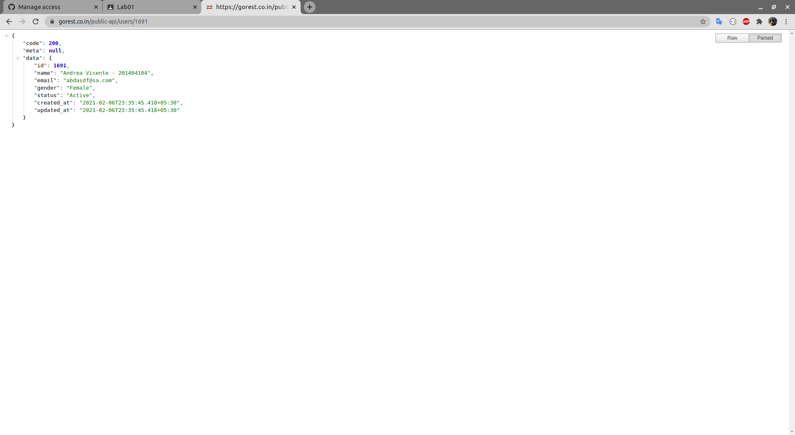

Andrea Nicte Vicente Campos

201404104 

Software Avanzado

# PRACTICA 1

Se utilizo https://gorest.co.in/ para desarrollar un cliente de webservice con go. Se utilizaron 4 requets methods: POST, GET, PUT, DELETE.


## Request Methods

```go
/*
	req,err :=  http.NewRequest(1, 2, 3)
		primer argumento, se indica el metodo a utilizar POST | GET | PUT etc
		segundo argumetno, se indica el url de la api a consumir
		tercer agumento, se indica el contenido del pody de la peticion

*/

/*
	agregar informacion al header de una peticion
	req.Header.Add(1, 2)
		primer argumento indica el tipo que se va agregar
		segundo argument indica el valor

 */
```


Metodo POST: se utilizo para crear un usuario

```GO
func createUser(userData []byte, data **info) {

	req,err := http.NewRequest("POST", (*data).url, bytes.NewBuffer(userData))
	req.Header.Set("Authorization", (*data).tokenB)
	req.Header.Add("Accept", "application/json")
	req.Header.Add("Content-Type", "application/json")
	client := &http.Client{}
	resp, err := client.Do(req)
	if err != nil {
		log.Println("Error on response.\n[ERRO] -", err)
	}
	body, _ := ioutil.ReadAll(resp.Body)
	log.Println(string([]byte(body)))


}
```


Metodo GET: se utilizo para listar un usuario

```GO
func getUser(data **info) {

	req,err := http.NewRequest("GET", (*data).url+"/"+(*data).id, nil)
	req.Header.Set("Authorization", (*data).tokenB)
	req.Header.Add("Accept", "application/json")
	req.Header.Add("Content-Type", "application/json")
	client := &http.Client{}
	resp, err := client.Do(req)
	if err != nil {
		log.Println("Error on response.\n[ERRO] -", err)
	}
	body, _ := ioutil.ReadAll(resp.Body)
	log.Println(string([]byte(body)))

}
```


Metodo PUT: se utilizo para actualizar un usuario

```GO
func updateUser(userData []byte, data **info) {

	req,err := http.NewRequest("PUT", (*data).url+"/"+(*data).id, 
    							bytes.NewBuffer(userData))
	req.Header.Set("Authorization", (*data).tokenB)
	req.Header.Add("Accept", "application/json")
	req.Header.Add("Content-Type", "application/json")
	client := &http.Client{}
	resp, err := client.Do(req)
	if err != nil {
		log.Println("Error on response.\n[ERRO] -", err)
	}
	body, _ := ioutil.ReadAll(resp.Body)
	log.Println(string([]byte(body)))

}

```


Metodo DELETE: se utilizo para eliminar un usuario

```GO
func deletUser(data **info) {

	req,err := http.NewRequest("DELETE", (*data).url+"/"+(*data).id, nil)
	req.Header.Set("Authorization", (*data).tokenB)
	req.Header.Add("Accept", "application/json")
	req.Header.Add("Content-Type", "application/json")
	client := &http.Client{}
	resp, err := client.Do(req)
	if err != nil {
		log.Println("Error on response.\n[ERRO] -", err)
	}
	body, _ := ioutil.ReadAll(resp.Body)
	log.Println(string([]byte(body)))

}

```


### Structs utilizados

Informacion del usuario

```go
type userStruct struct {
	Name string  `json:"name"`
	Gender string `json:"gender"`
	Email string `json:"email"`
	Status string `json:"status"`
}

user := userStruct {Name: "name",Gender: "Female", Email: "andrea201404104@email.com", Status: "Active"}
```


Informacion del url, toke, id del usuario

```go
type info struct {
	url string
	tokenB string
	id string
}

data := info{url: "https://gorest.co.in/public-api/users", tokenB: "Bearer 34607adde1718faea5a4c5f0c73c69c1f864b318679ce0a93dbce6a5e55b907c" , id: "0000"}
```


### Screenshots de programa funcional

Para corroborar de que funciona el programa, se adjuntan imagenes que comprueban este con el programa de postman.


Creando un usuario

El id del usuario es **1510**


Obteniendo informacion del usuario 

El id del usuario es **1510**


Actualizando usuario

El id del usuario es **1510**


Eliminando usuario

El id del usuario es **1510**


Contacto dejado para la verificacion  

Codigo **1691**

https://gorest.co.in/public-api/users/1691


